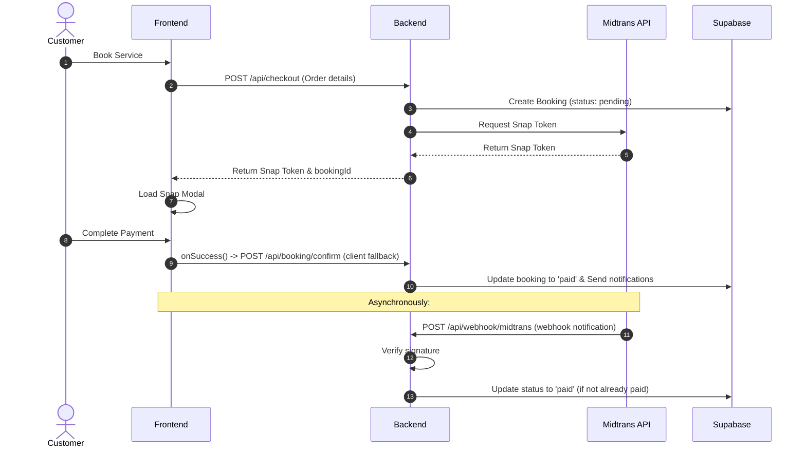

# Payment Gateway Integration (Midtrans Sandbox)

This guide documents the payment workflow integration with Midtrans Sandbox and instructions on how to test transactions locally using Ngrok.

---

## 1. Payment Flow Architecture

The platform uses **Midtrans Snap SDK** for a seamless, secure overlay payment modal.



---

## 2. Webhook / Notification Handler (`/api/webhook/midtrans`)

Midtrans sends an HTTP POST notification to your Webhook Endpoint when the transaction changes status (e.g. `settlement`, `pending`, `expire`, `cancel`).

### Signature Verification
To prevent fraudulent status changes, the backend computes a SHA512 signature key and verifies it against Midtrans:
$$\text{Signature} = \text{SHA512}(\text{order\_id} + \text{status\_code} + \text{gross\_amount} + \text{ServerKey})$$

If the signature matches, the system updates the reservation status in the `bookings` table to `paid` or `cancelled` accordingly.

---

## 3. Local Testing Setup (Using Ngrok)

Because `localhost:3000` is private, Midtrans cannot send webhooks directly to your computer. You must use **Ngrok** to create a public tunnel:

### Step 1: Start Ngrok Tunnel
Jalankan ngrok pada port 3000:
```bash
ngrok http 3000
```
Copy the forwarding URL (e.g., `https://abcd-123.ngrok-free.app`).

### Step 2: Configure Midtrans Dashboard
1. Log in to the [Midtrans Sandbox Dashboard](https://dashboard.sandbox.midtrans.com/).
2. Navigate to **Settings** -> **Configuration**.
3. In **Payment Notification URL**, enter:
   `https://your-ngrok-url.ngrok-free.app/api/webhook/midtrans`
4. In **Finish Redirect URL** / **Unfinish Redirect URL**, you can set:
   `https://your-ngrok-url.ngrok-free.app/booking/[order_id]`
5. Click **Update** to save.

### Step 3: Trigger a Simulated Payment
1. Perform a booking on `http://localhost:3000`.
2. Copy the virtual account number from the popup.
3. Open the **[Midtrans Sandbox Simulator](https://simulator.sandbox.midtrans.com/)**.
4. Paste the virtual account number and pay.
5. Check your Ngrok terminal for `POST /api/webhook/midtrans 200 OK` logs. The app will receive the webhook and update the booking to **Paid** automatically!
